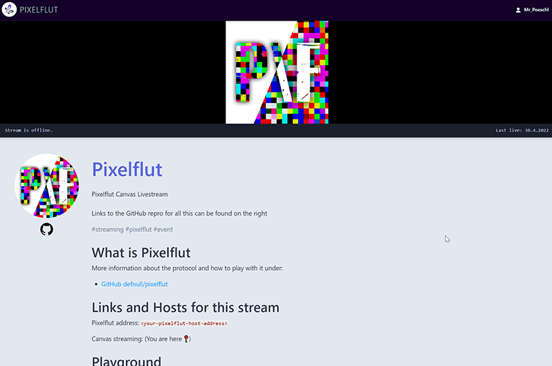
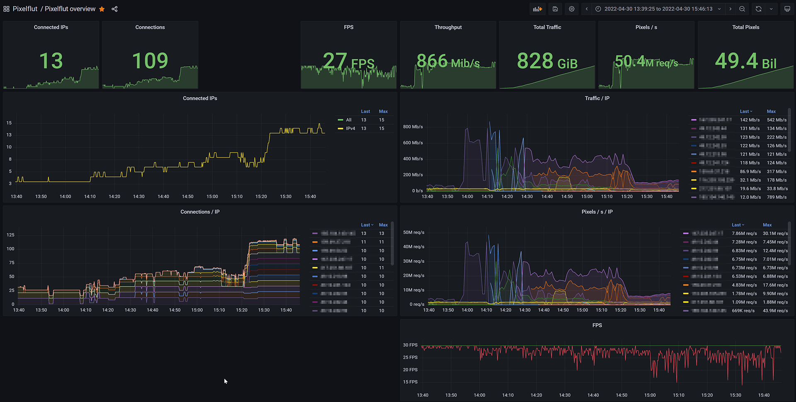
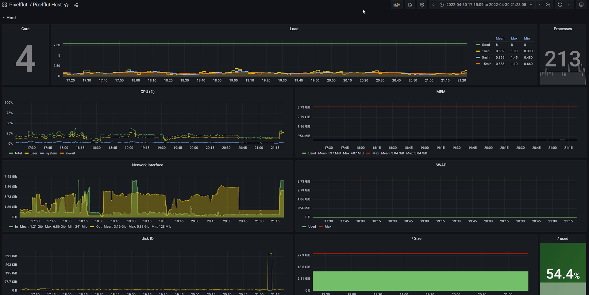

# pixelflut-infrastructure

A docker-setup with pixelflut server, a streaming website and monitoring for the hosts.

This setup assumes two machines in your infrastructure:
Server 1 to run only the pixelflut server
Server 2 to run everything else

People will send their Pixelflut commands to the first server, which will host the Pixelflut canvas.
The second server can be used to view the canvas via a HTML5 live stream and chat.
Also the stream gets recorded for later use if enabled.
For the admins there is a grafana available to monitor the Pixelflut statistics as well as host stats.

The Pixelflut infrastructure also contains an hourly wipe of the canvas.
This might be handy to clear leftovers.
It is done by flooding the background image from the `wiper` directory with 1 connection to the canvas.

## Preperation

You must have docker and docker-compose installed. See https://docs.docker.com/get-docker/ and https://docs.docker.com/compose/install/.

If you want to use Ansible to set everything up for you, the last preperation section is what you are looking for.

After that adjust the `.env` file to your requirements, the variables will be used by the starting docker containers.
When everything is set, execute `docker-compose -f docker-compose.pixelflut-host.yml up` on your host for the Pixelflut server.
Afterwards execute `docker-compose -f docker-compose.monitoring-host.yml up` on the host intended for monitoring and forwarding.
Make sure that the `.env` file is identical on both machines.

**When renaming the project folder, adjust the docker network name in the `docker-compose.monitoring-host` file on the traefik container.**

### Pixelflut host

Don't forget to limit the connections per IP on the Pixelflut host, to make it a little challenging for all players.
As iptables is available everywhere use those two commands to limit to 10 (or what you like) connections for each IPv4 and IPv6.

```shell
iptables -A INPUT -p tcp -m tcp --dport 1234 --tcp-flags FIN,SYN,RST,ACK SYN -m connlimit --connlimit-above 10 --connlimit-mask 32 --connlimit-saddr -j REJECT --reject-with icmp-port-unreachable
ip6tables -A INPUT -p tcp -m tcp --dport 1234 --tcp-flags FIN,SYN,RST,ACK SYN -m connlimit --connlimit-above 10 --connlimit-mask 128 --connlimit-saddr -j REJECT --reject-with icmp6-port-unreachable
```

Also block the direct VNC port on the Pixelflut host, since all clients should use the VNCmux connection.

```shell
iptables -I INPUT --proto tcp --dport 5901 -j REJECT
# Allow your monitoring server the connection
iptables -I INPUT --source <ip of monitoring server> --proto tcp --dport 5901 -j ACCEPT

ip6tables -I INPUT --proto tcp --dport 5901 -j REJECT
# Allow your monitoring server the connection
ip6tables -I INPUT --source <ip of monitoring server> --proto tcp --dport 5901 -j ACCEPT

```

### Running on Windows

*This repository does not really support running it on Windows, you may experience issues here.*

If you intend to use this infrastructure on a Windows system, make sure to disable `network_mode: "host"` in the `docker-compose.*.yml` files.
Docker Desktop does not support this network mode, so you have to map the ports individually.
Especially on the Pixelflut Server inside the docker container the network performance will be very poor. 

### Ansible installer

In the `ansible` folder are ansible playbooks ready to distribute this repository to two hosts and set them up and running.
More on the [README](ansible/README.md) inside the folder.

## Overview of services


## Breakwater as Pixelflut Server

This system uses Breakwater as Pixelflut server. It is written in Rust and provides a sufficent performance, even for big events.
As a bonus it offers a integrated prometheus interface which is used for gattering statistics.

## Owncast for Streaming

For comfortable streaming of the Pixelflut Canvas Owncast is used.
It gets the live feed from a gstreamer container, that encodes and send the VNC connection display as RTMP stream.
The stream willbe also recorded to the `/record` folder on the monitoring host as .mkv files. (See [Post-Processing](#post-processing))

It is pre-configured with some basic configuration, but should be customized over the Admin-Interface on `<monitoring_url>/admin`.



## Grafana Pixelflut Dashboard

Grafana is available with dashboards for the Pixelflut and host statistics.
The data in Grafana will be persisted between restarts and retains for 14 days.

 

## HTTPS via Traefik

For a secure TLS connection Traefik is used for the monitoring server and provides a encrypted connection to Grafana.
The certificate for the connection is recieved from Let's encrypt and is stored in a internal volume, so it stays persistant between restarts.
The traefik Dashboard is available under `<monitoring_url>/traefik`, in case the domain correctly entered in the `.env` file.

### Routes

Traefik has the following routes setup by default:

* `<monitoring_url>` -> Owncast
* `<monitoring_url>/grafana` -> Monitoring
* `<monitoring_url>/traefik` -> Traefik Dashboard

## Post-Processing

Before using the recorded video files I recommend to convert it to a standardized mp4 format for more acceptance on common video platforms.
The recorded files have no normalized framerates and are optimized for a fast low-latency stream.

To make this easy a script in the `post-processing tools` folder of the repository will combine multiple videos and convert them to a mp4
file with ffmpeg.
As Output bitrate `6000 Bit/s` is used.
Since I use a nVidea GPU on my machine the `hevc_nvenc` is used.
If you need to encode the recordings via CPU replace the encoder with `libx265` and you are good to go.

## Thanks

* https://github.com/sbernauer/pixelflut-infrastructure for the initial infrastructure
* https://github.com/sbernauer/breakwater for the used pixelflut server
* https://github.com/nicolargo/glances for the docker-based host monitoring
